# Architecture Diagrams

**Purpose**: Visual documentation of system architecture, component relationships, and data flows.

**Why Diagrams**: "A picture is worth a thousand words" - diagrams communicate complex systems quickly and reduce misunderstandings.

---

## Diagram Types in This Directory

| Type                                        | Purpose                                  | Tool                  | Example              |
| ------------------------------------------- | ---------------------------------------- | --------------------- | -------------------- |
| [System Context](#c4-system-context)        | High-level system overview               | Mermaid C4            | `system-context.md`  |
| [Container](#c4-container)                  | Major runtime containers/services        | Mermaid C4            | `container.md`       |
| [Component](#c4-component)                  | Components within a container            | Mermaid C4            | `component.md`       |
| [Sequence](#sequence-diagrams)              | Interactions over time                   | Mermaid/PlantUML      | `sequence-*.md`      |
| [Entity-Relationship](#er-diagrams)         | Database schema                          | Mermaid               | `er-diagram.md`      |
| [State Machine](#state-diagrams)            | State transitions                        | Mermaid               | `state-*.md`         |
| [Data Flow](#data-flow-diagrams)            | How data moves through system            | Mermaid Flowchart     | `dataflow-*.md`      |

---

## Quick Start

### Creating a New Diagram

1. **Choose type**: What are you documenting?
2. **Pick tool**: Mermaid (recommended) or PlantUML
3. **Copy template**: From this README or example files
4. **Edit**: Modify for your use case
5. **Render**: Use GitHub, VS Code, or online renderer
6. **Commit**: Add to git with descriptive filename

### Rendering Diagrams

**GitHub**: Automatically renders Mermaid in `.md` files

**VS Code**: Install "Markdown Preview Mermaid Support" extension

**Online**: 
- Mermaid: https://mermaid.live/
- PlantUML: https://www.plantuml.com/plantuml/

**CLI**:
```bash
# Mermaid CLI
npm install -g @mermaid-js/mermaid-cli
mmdc -i diagram.mmd -o diagram.png

# PlantUML CLI  
java -jar plantuml.jar diagram.puml
```

---

## C4 Model Diagrams

### Overview

The C4 model provides hierarchical views of software architecture:

1. **System Context**: How your system fits in the world
2. **Container**: High-level technology choices
3. **Component**: Logical components within containers
4. **Code**: (Optional) Class diagrams - use sparingly

**Reference**: https://c4model.com/

### C4 System Context

**Shows**: System boundaries, external users, external systems

**Template**:

````markdown
# System Context Diagram

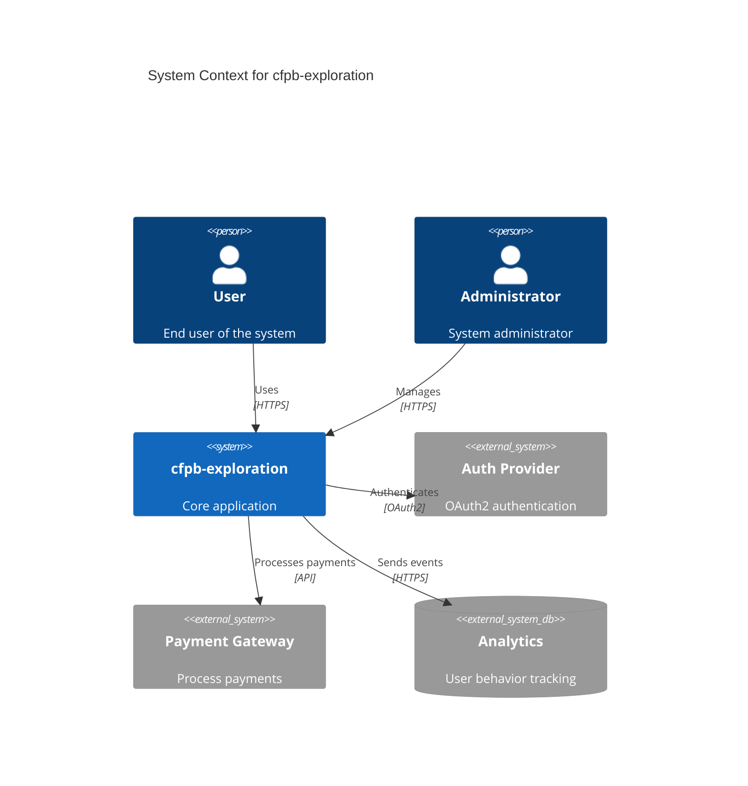
````

**Example**:

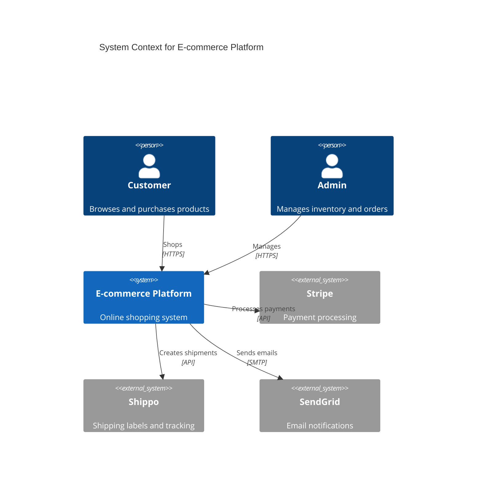

### C4 Container

**Shows**: High-level technology choices, data storage, communication

**Template**:

````markdown
# Container Diagram

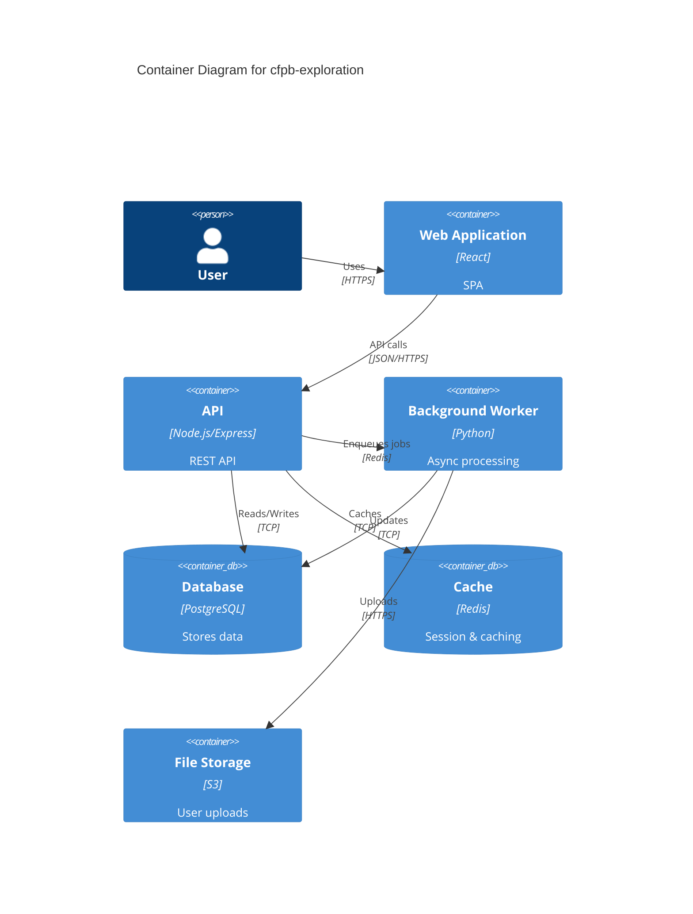
````

**Example**:

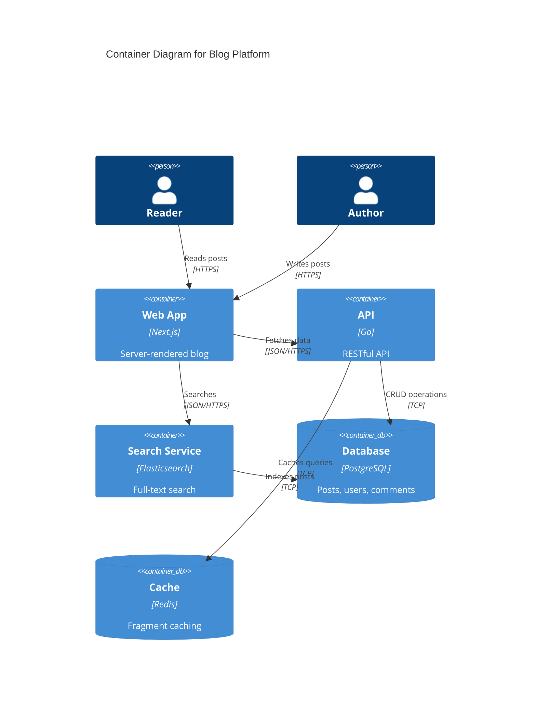

### C4 Component

**Shows**: Major components within a container

**Template**:

````markdown
# Component Diagram

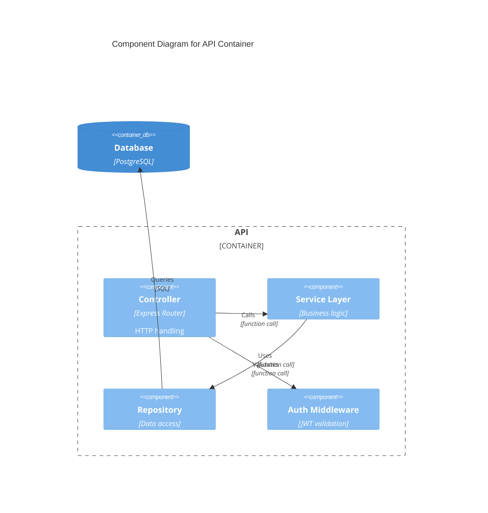
````

---

## Sequence Diagrams

**Shows**: Interactions between components over time

**Template**:

````markdown
# Sequence Diagram: {{INTERACTION_NAME}}

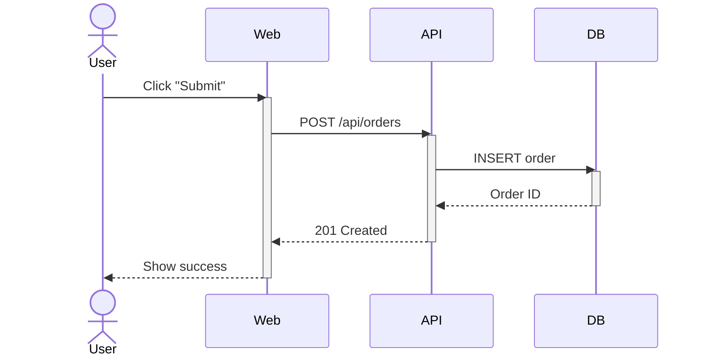
````

**Example**: Authentication Flow

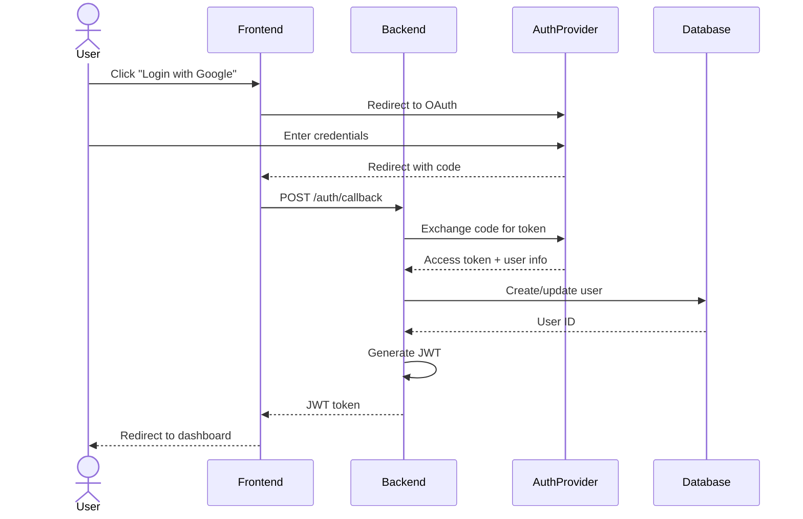

**PlantUML Alternative**:

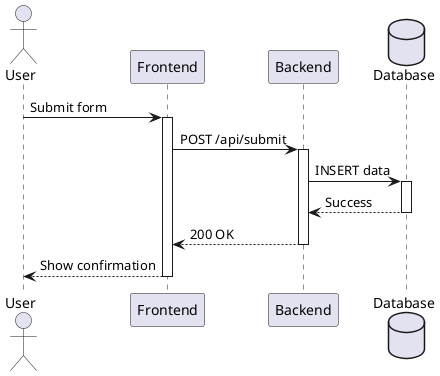

---

## Entity-Relationship Diagrams

**Shows**: Database schema and relationships

**Template**:

````markdown
# ER Diagram: Database Schema

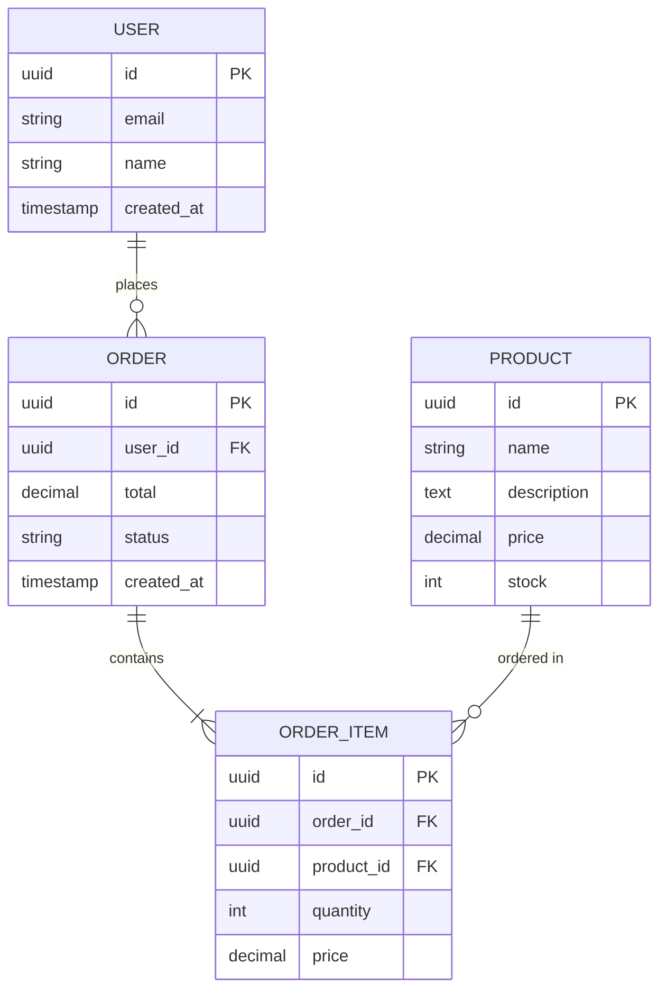
````

**Example**: Blog Schema

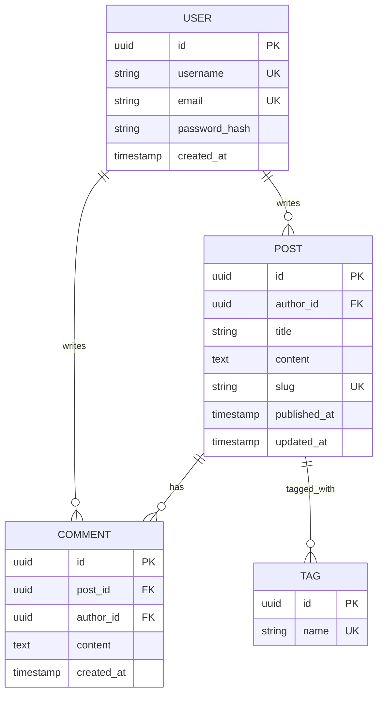

---

## State Diagrams

**Shows**: State transitions and events

**Template**:

````markdown
# State Diagram: {{ENTITY}} Lifecycle

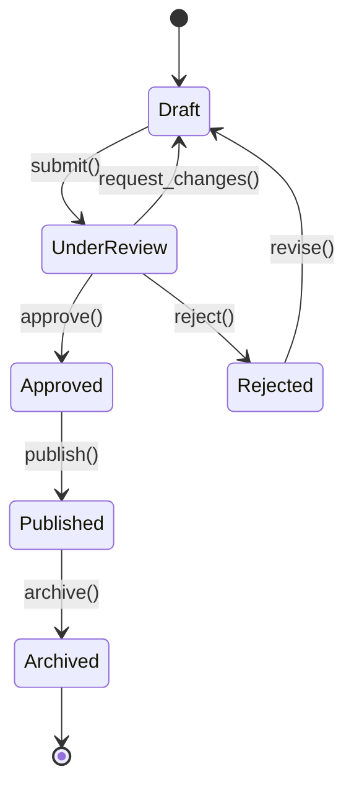
````

**Example**: Order State Machine

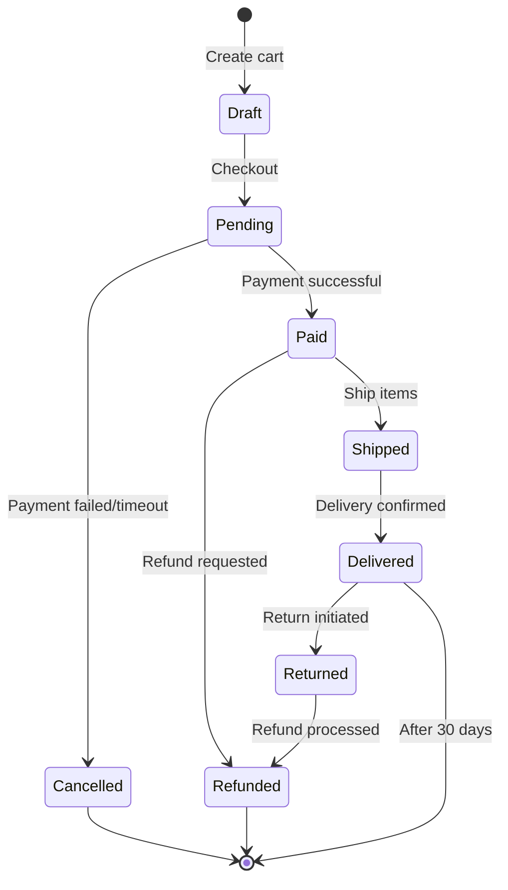

---

## Data Flow Diagrams

**Shows**: How data moves through the system

**Template**:

````markdown
# Data Flow: {{PROCESS_NAME}}

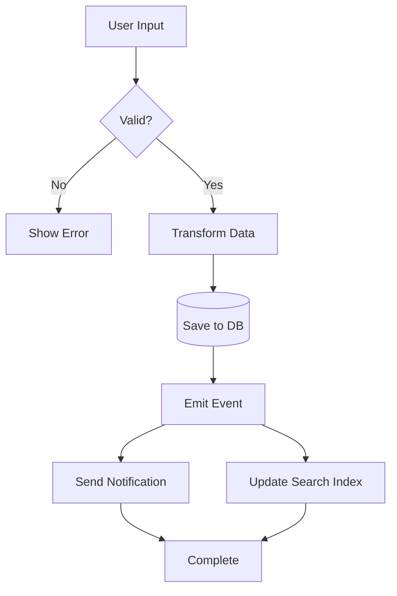
````

**Example**: File Upload Flow

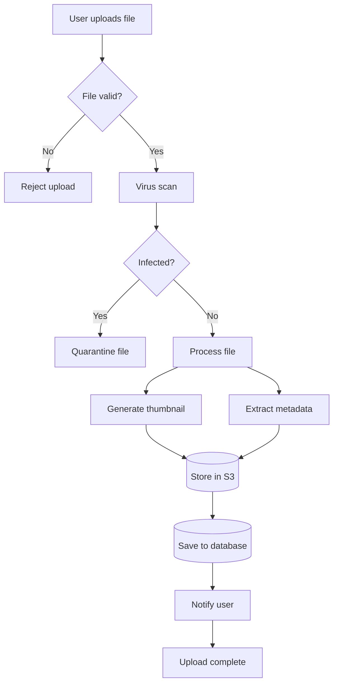

---

## Best Practices

### General Guidelines

✅ **Do**:
- Keep diagrams simple and focused
- Update diagrams when architecture changes
- Use consistent naming conventions
- Include legend if using custom symbols
- Date diagrams to show currency
- Link diagrams to relevant ADRs

❌ **Don't**:
- Create diagrams for every minor detail
- Let diagrams become outdated
- Use inconsistent notation
- Create overly complex diagrams
- Forget to commit diagram sources

### Choosing the Right Diagram

| To Show...                        | Use...                   |
| --------------------------------- | ------------------------ |
| System in its environment         | C4 Context               |
| Major technology choices          | C4 Container             |
| Internal structure                | C4 Component             |
| Request/response flow             | Sequence Diagram         |
| Database schema                   | ER Diagram               |
| State transitions                 | State Diagram            |
| Data processing pipeline          | Data Flow Diagram        |
| Deployment architecture           | Deployment Diagram       |
| Network topology                  | Network Diagram          |

### Naming Conventions

**Files**: `{type}-{name}.md` or `{name}-{type}.md`

Examples:
- `system-context.md`
- `user-authentication-sequence.md`
- `database-er-diagram.md`
- `order-state-machine.md`

### Keeping Diagrams Current

**Triggers for update**:
- Architectural decision (ADR) made
- New service/component added
- Integration point changed
- State machine logic updated
- Database schema modified

**Review schedule**:
- **Quarterly**: Full diagram audit
- **Per release**: Update affected diagrams
- **Per ADR**: Create/update relevant diagram

---

## Tools Comparison

### Mermaid

**Pros**:
- ✅ Native GitHub rendering
- ✅ Text-based (version control friendly)
- ✅ Wide tooling support
- ✅ Simple syntax
- ✅ No external dependencies for viewing

**Cons**:
- ❌ Less expressive than PlantUML
- ❌ Limited customization
- ❌ Fewer diagram types

**Best for**: Most use cases, team collaboration

### PlantUML

**Pros**:
- ✅ Very expressive
- ✅ Many diagram types
- ✅ Mature and stable
- ✅ Extensive customization

**Cons**:
- ❌ Requires Java runtime or external service
- ❌ GitHub doesn't render directly
- ❌ Steeper learning curve

**Best for**: Complex diagrams, detailed documentation

### Draw.io / Lucidchart

**Pros**:
- ✅ WYSIWYG editor
- ✅ Easy for non-technical users
- ✅ Beautiful diagrams

**Cons**:
- ❌ Binary files (poor for version control)
- ❌ Requires external tool
- ❌ Harder to keep in sync with code

**Best for**: Presentations, stakeholder communication

**Recommendation**: Use Mermaid as default, PlantUML for complex cases, Draw.io for presentations.

---

## Examples in This Directory

[Add links to your actual diagram files here]

- [System Context](./system-context.md)
- [Container Diagram](./container.md)
- [Authentication Sequence](./auth-sequence.md)
- [Database Schema](./database-er.md)
- [Order State Machine](./order-states.md)

---

## Learning Resources

### Mermaid

- **Official Docs**: https://mermaid.js.org/
- **Live Editor**: https://mermaid.live/
- **GitHub Guide**: https://docs.github.com/en/get-started/writing-on-github/working-with-advanced-formatting/creating-diagrams

### PlantUML

- **Official Site**: https://plantuml.com/
- **Guide**: https://plantuml.com/guide
- **Examples**: https://real-world-plantuml.com/

### C4 Model

- **Official Site**: https://c4model.com/
- **Diagrams**: https://c4model.com/#Diagrams
- **Mermaid C4**: https://mermaid.js.org/syntax/c4c.html

### General Architecture Diagramming

- **C4 Model Guide**: https://c4model.com/
- **Simon Brown's Site**: https://simonbrown.je/
- **Software Architecture Guide**: https://martinfowler.com/architecture/

---

## Contributing

When adding new diagrams:

1. Follow naming conventions
2. Use templates from this README
3. Add entry to "Examples" section above
4. Link from relevant documentation
5. Reference in ADR if architectural decision
6. Test rendering (GitHub, VS Code, or online tool)

---

**Document Version**: 1.0
**Last Updated**: 2025-12-17
**Maintained By**: Development Team
**Feedback**: Open GitHub issue with "diagrams:" prefix
