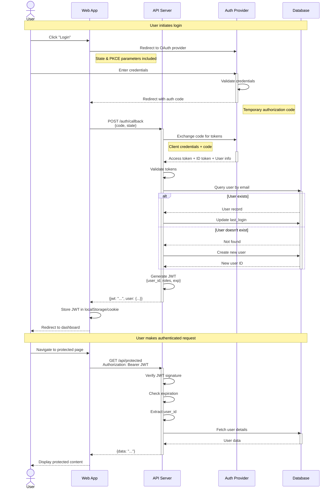
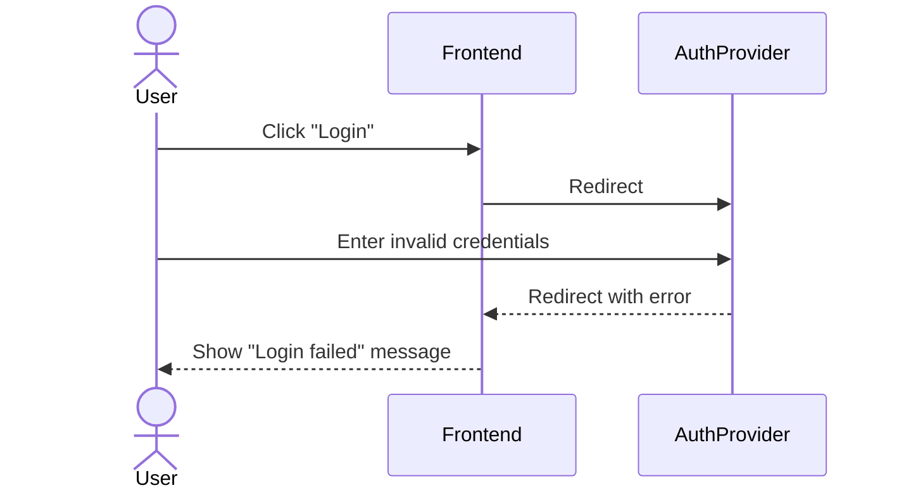
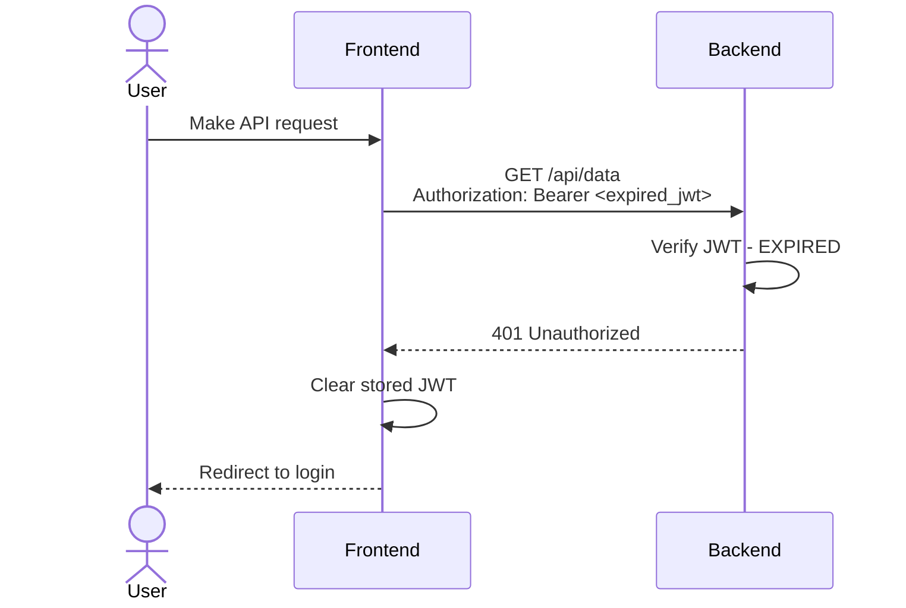
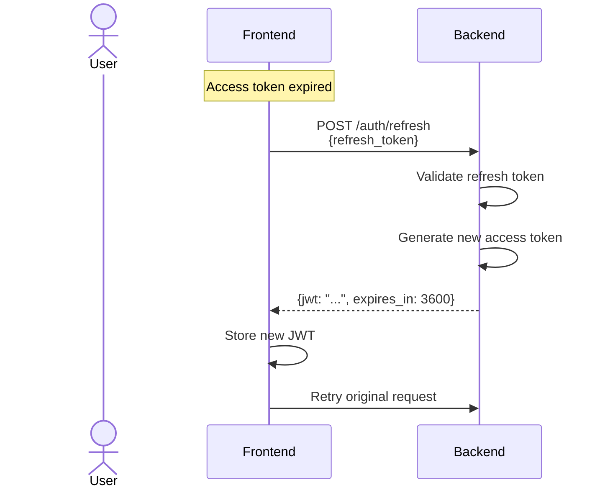
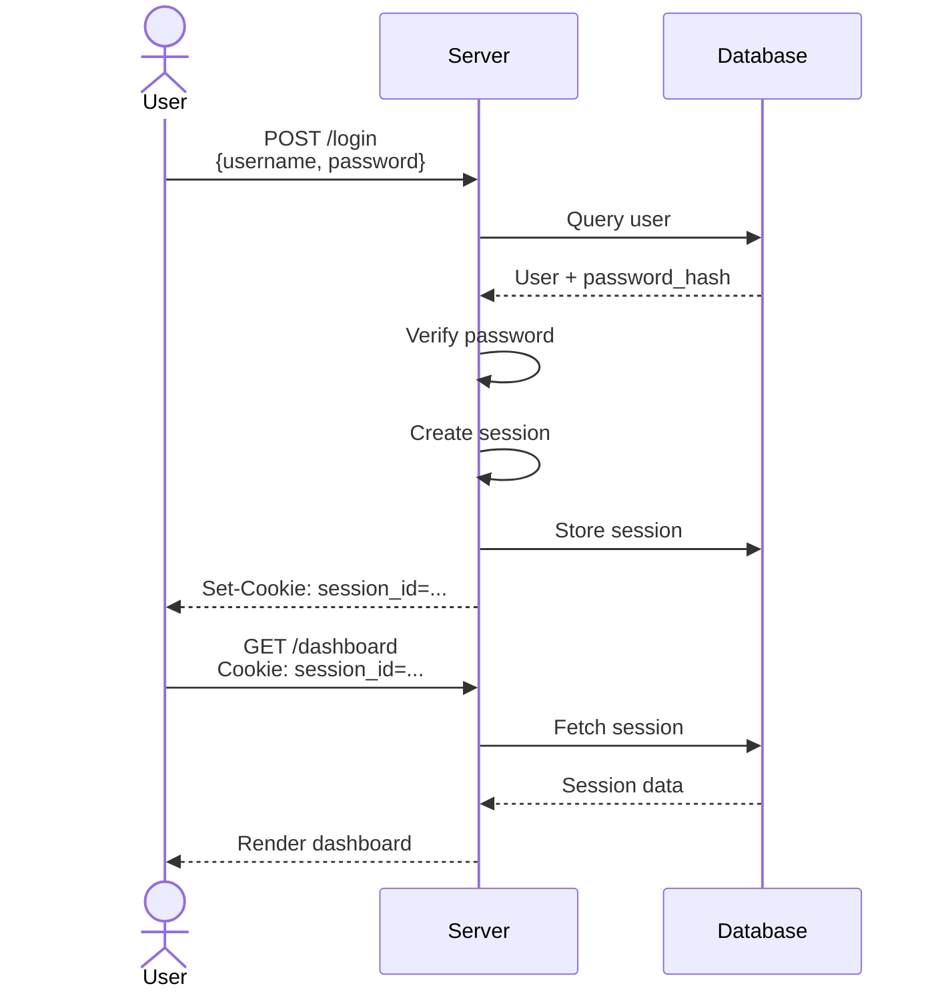
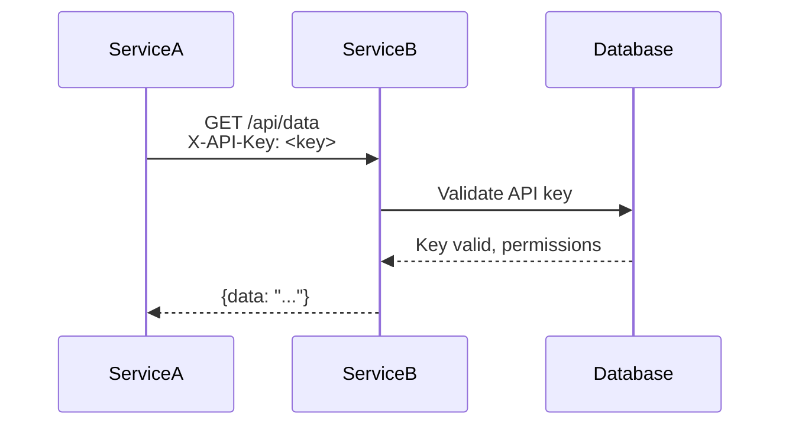

# Authentication Sequence Diagram

**Purpose**: Show the complete authentication flow from user login to authorized API access

**Last Updated**: {{CURRENT_DATE}}

---

## Diagram

---

## Flow Description

### 1. Login Initiation

User clicks "Login" button and is redirected to the OAuth provider (e.g., Google, GitHub, Auth0).

**Parameters sent**:
- `client_id`: Application identifier
- `redirect_uri`: Callback URL
- `scope`: Requested permissions (e.g., `openid profile email`)
- `state`: CSRF protection token
- `code_challenge`: PKCE parameter (for public clients)

### 2. User Authentication

User authenticates with the OAuth provider using their credentials (username/password, 2FA, etc.).

### 3. Authorization Code Exchange

OAuth provider redirects back to application with:
- `code`: Temporary authorization code (single-use, short-lived)
- `state`: Same state parameter (verify CSRF protection)

Frontend sends code to backend, which exchanges it for tokens:
- **Access Token**: Used to access protected resources
- **ID Token**: Contains user identity information (JWT)
- **Refresh Token** (optional): Used to obtain new access tokens

### 4. User Creation/Update

Backend:
1. Validates tokens (signature, expiration, issuer)
2. Extracts user information from ID token
3. Checks if user exists in database
4. Creates new user or updates existing user's last_login

### 5. Session Token Generation

Backend generates its own JWT containing:
- `user_id`: Internal user identifier
- `roles`: User permissions/roles
- `exp`: Token expiration time
- `iat`: Token issued-at time

This JWT is returned to frontend for subsequent API calls.

### 6. Authenticated Requests

For each protected API request:
1. Frontend includes JWT in `Authorization: Bearer <token>` header
2. Backend verifies JWT signature and expiration
3. Backend extracts user_id and fetches user data if needed
4. Backend authorizes action based on user roles
5. Backend returns protected data

---

## Security Considerations

### Token Storage

**Frontend**:
- **Preferred**: HttpOnly cookie (prevents XSS)
- **Alternative**: localStorage (simpler but vulnerable to XSS)
- Never store tokens in sessionStorage or URL

**Backend**:
- Store refresh tokens securely (encrypted at rest)
- Never log tokens

### Token Lifetime

- **Access tokens**: Short-lived (15 minutes - 1 hour)
- **Refresh tokens**: Long-lived (7-90 days)
- **Session cookies**: Match access token lifetime

### PKCE (Proof Key for Code Exchange)

Required for public clients (SPAs, mobile apps):
- Prevents authorization code interception attacks
- Use code_challenge and code_verifier parameters

### CSRF Protection

- Validate `state` parameter matches
- Use HttpOnly, SameSite cookies
- Implement CSRF tokens for state-changing operations

---

## Error Scenarios

### Authentication Failure

### Expired JWT

### Token Refresh

---

## Alternative Flows

### Session-Based Authentication

For server-rendered applications:

### API Key Authentication

For service-to-service communication:

---

## Implementation Checklist

- [ ] OAuth client registered with provider
- [ ] Client ID and secret configured (backend only)
- [ ] Redirect URLs whitelisted
- [ ] PKCE implemented (for public clients)
- [ ] State parameter validated
- [ ] Tokens validated (signature, expiration, issuer)
- [ ] User database schema includes auth fields
- [ ] JWT secret configured (strong random value)
- [ ] Token refresh endpoint implemented
- [ ] Logout endpoint implemented (invalidate tokens)
- [ ] Rate limiting on auth endpoints
- [ ] Audit logging for auth events

---

## Related Documentation

- [Authentication ADR](../ADRs/XXX-authentication.md) - Why we chose this approach
- [Security Policy](../SECURITY.md) - Security guidelines
- [API Documentation](../API.md) - API endpoint details

---

**Note**: This is a template. Customize with your specific OAuth provider and authentication flow.
