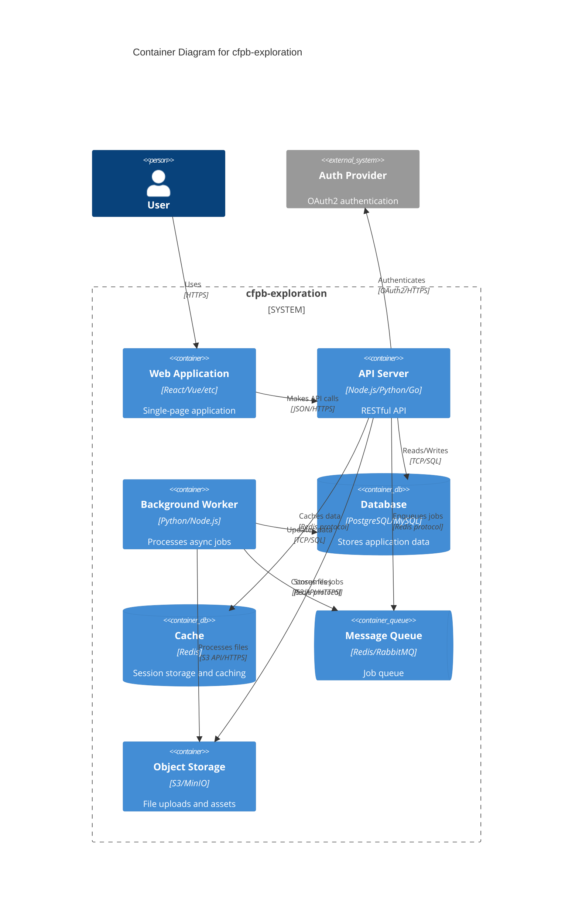

# Container Diagram

**Purpose**: Show the high-level technology choices and how containers communicate

**Last Updated**: {{CURRENT_DATE}}

---

## Diagram

---

## Containers

### Web Application

**Technology**: [e.g., React 18 + TypeScript]
**Purpose**: User-facing single-page application
**Deployment**: [e.g., Static hosting on CDN, Vercel, Netlify]

**Responsibilities**:
- User interface and interactions
- Client-side routing
- Form validation
- API communication

### API Server

**Technology**: [e.g., Node.js with Express, Python with FastAPI, Go with Gin]
**Purpose**: Business logic and data access layer
**Deployment**: [e.g., Docker containers on Kubernetes, AWS ECS, Heroku]

**Responsibilities**:
- Request authentication and authorization
- Business logic execution
- Database operations
- External API integration
- File upload handling

### Background Worker

**Technology**: [e.g., Python with Celery, Node.js with Bull]
**Purpose**: Asynchronous job processing
**Deployment**: [Same as API server or separate instances]

**Responsibilities**:
- Long-running tasks (report generation, batch processing)
- Scheduled jobs (cleanup, data synchronization)
- Email sending
- File processing (thumbnail generation, video transcoding)

### Database

**Technology**: [e.g., PostgreSQL 15]
**Purpose**: Primary data store
**Deployment**: [e.g., Managed service like RDS, self-hosted]

**Data**:
- Users and authentication
- Application domain data
- Audit logs
- Configuration

### Cache

**Technology**: [e.g., Redis 7]
**Purpose**: Fast data access and session storage
**Deployment**: [e.g., Managed Redis, self-hosted]

**Uses**:
- Session data
- Frequently accessed data (user profiles, configuration)
- Rate limiting counters
- Temporary data (OTP codes, verification tokens)

### Message Queue

**Technology**: [e.g., Redis with Bull, RabbitMQ, AWS SQS]
**Purpose**: Asynchronous job queue
**Deployment**: [Same as Cache or separate]

**Job Types**:
- Email sending
- Report generation
- Data import/export
- Cleanup tasks

### Object Storage

**Technology**: [e.g., AWS S3, MinIO, Google Cloud Storage]
**Purpose**: File and asset storage
**Deployment**: [Cloud service or self-hosted]

**Stored**:
- User uploads (images, documents)
- Generated reports
- Static assets (if not using CDN)
- Backups

---

## Communication Protocols

| From             | To              | Protocol       | Authentication        |
| ---------------- | --------------- | -------------- | --------------------- |
| Web → API        | REST           | JSON/HTTPS     | JWT Bearer token      |
| API → Database   | SQL            | TCP            | Username/password     |
| API → Cache      | Redis Protocol | TCP            | Password (if configured) |
| API → Queue      | Redis Protocol | TCP            | Password (if configured) |
| API → Storage    | S3 API         | HTTPS          | AWS credentials       |
| Worker → Queue   | Redis Protocol | TCP            | Password (if configured) |
| Worker → Database| SQL            | TCP            | Username/password     |

---

## Scaling Considerations

### Horizontal Scaling

**API Server**: ✅ Stateless, can scale horizontally behind load balancer

**Background Worker**: ✅ Can run multiple instances consuming from shared queue

**Web Application**: ✅ Static files, infinite scalability via CDN

### Vertical Scaling

**Database**: May need vertical scaling for heavy read/write workloads

**Cache**: Consider Redis Cluster for large datasets

**Message Queue**: Consider RabbitMQ for complex routing, separate from cache

---

## Technology Decisions

See [Architecture Decision Records](../ADRs/) for rationale behind technology choices:

- ADR XXX: Choice of [Frontend Framework]
- ADR XXX: Choice of [Backend Framework]
- ADR XXX: Database selection
- ADR XXX: Caching strategy

---

## Related Diagrams

- [System Context](./system-context.md) - Higher-level view
- [Component Diagram](./component-api.md) - Detailed view of API container
- [Deployment Diagram](./deployment.md) - Production infrastructure

---

**Note**: This is a template. Customize with your actual technology stack and architecture.
