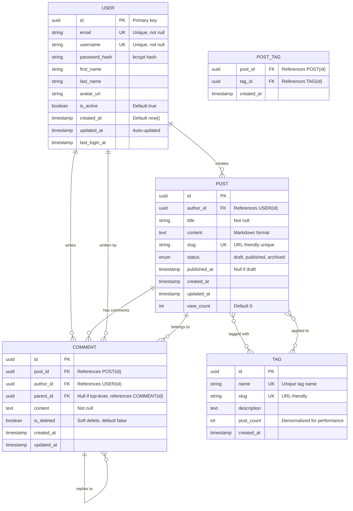

# Database Entity-Relationship Diagram

**Purpose**: Document database schema, relationships, and constraints

**Last Updated**: {{CURRENT_DATE}}

---

## Schema Diagram



---

## Entities

### USER

**Purpose**: Store user accounts and authentication information

**Indexes**:
- `PRIMARY KEY (id)`
- `UNIQUE INDEX (email)`
- `UNIQUE INDEX (username)`
- `INDEX (created_at)` - For user growth analytics
- `INDEX (last_login_at)` - For activity tracking

**Constraints**:
- `email` must be valid email format
- `username` must be 3-30 characters, alphanumeric + underscore
- `password_hash` must be bcrypt with minimum cost 10

**Lifecycle**:
- Created on user registration
- Soft delete (set `is_active = false`) rather than hard delete
- Cascade delete to all user's posts and comments (configured at app level)

---

### POST

**Purpose**: Store blog posts or articles

**Indexes**:
- `PRIMARY KEY (id)`
- `FOREIGN KEY (author_id) REFERENCES USER(id)`
- `UNIQUE INDEX (slug)`
- `INDEX (author_id, created_at)` - Author's posts chronologically
- `INDEX (status, published_at)` - Published posts for listing
- `INDEX (created_at)` - Recent posts

**Constraints**:
- `title` must be 1-200 characters
- `slug` must be unique, URL-safe
- `status` must be one of: 'draft', 'published', 'archived'
- `published_at` must be null if status is 'draft'

**Lifecycle**:
- Created when author starts writing (status = 'draft')
- Published when author clicks publish (status = 'published', published_at = now())
- Can be archived (status = 'archived')
- Soft delete preferred over hard delete (move to 'archived' status)

**Business Rules**:
- Author can edit their own posts
- Admin can edit any post
- Published posts cannot be unpublished (only archived)
- Slug auto-generated from title if not provided

---

### COMMENT

**Purpose**: Store comments on posts, supports nested replies

**Indexes**:
- `PRIMARY KEY (id)`
- `FOREIGN KEY (post_id) REFERENCES POST(id)`
- `FOREIGN KEY (author_id) REFERENCES USER(id)`
- `FOREIGN KEY (parent_id) REFERENCES COMMENT(id)` - Self-referential
- `INDEX (post_id, created_at)` - Post's comments chronologically
- `INDEX (author_id, created_at)` - User's comments
- `INDEX (parent_id)` - For loading comment replies

**Constraints**:
- `content` must be 1-10,000 characters
- `parent_id` must reference existing comment in same post
- Maximum nesting depth: 3 levels (enforced at application level)

**Lifecycle**:
- Created when user submits comment
- Soft delete (set `is_deleted = true`) to preserve comment threads
- Cascade delete if parent post deleted

**Business Rules**:
- User can edit/delete their own comments within 15 minutes
- Author of post can delete any comment on their post
- Admin can delete any comment
- Replies inherit permissions from parent

---

### TAG

**Purpose**: Categorize posts with tags

**Indexes**:
- `PRIMARY KEY (id)`
- `UNIQUE INDEX (name)`
- `UNIQUE INDEX (slug)`
- `INDEX (post_count DESC)` - For popular tags

**Constraints**:
- `name` must be 1-50 characters
- `slug` must be URL-safe, unique

**Lifecycle**:
- Created when first applied to a post or by admin
- `post_count` incremented/decremented via trigger or application logic
- Can be merged with another tag (admin function)
- Orphaned tags (post_count = 0) can be cleaned up periodically

**Business Rules**:
- Anyone can suggest new tags
- Tags must be approved by moderators before visible
- Maximum 10 tags per post

---

### POST_TAG (Junction Table)

**Purpose**: Many-to-many relationship between posts and tags

**Indexes**:
- `PRIMARY KEY (post_id, tag_id)` - Composite primary key
- `FOREIGN KEY (post_id) REFERENCES POST(id) ON DELETE CASCADE`
- `FOREIGN KEY (tag_id) REFERENCES TAG(id) ON DELETE CASCADE`
- `INDEX (tag_id, created_at)` - Posts by tag chronologically

**Lifecycle**:
- Created when tag applied to post
- Deleted when tag removed from post or post/tag deleted

---

## Relationships

### One-to-Many

**USER → POST**: One user creates many posts
- Foreign key: `POST.author_id → USER.id`
- Cascade: Soft delete posts when user deactivated

**USER → COMMENT**: One user writes many comments
- Foreign key: `COMMENT.author_id → USER.id`
- Cascade: Soft delete comments when user deactivated

**POST → COMMENT**: One post has many comments
- Foreign key: `COMMENT.post_id → POST.id`
- Cascade: Delete comments when post deleted

### Many-to-Many

**POST ↔ TAG**: Posts have many tags, tags apply to many posts
- Junction table: `POST_TAG`
- Foreign keys: `POST_TAG.post_id → POST.id`, `POST_TAG.tag_id → TAG.id`
- Cascade: Delete junction record when either post or tag deleted

### Self-Referential

**COMMENT → COMMENT**: Comments can reply to other comments
- Foreign key: `COMMENT.parent_id → COMMENT.id`
- Cascade: When parent comment deleted, replies remain but show "[deleted]"

---

## Common Queries

### Get user's published posts

```sql
SELECT * FROM POST
WHERE author_id = ? AND status = 'published'
ORDER BY published_at DESC
LIMIT 20;
```

**Index Used**: `(author_id, created_at)`

### Get post with tags

```sql
SELECT p.*, array_agg(t.name) as tags
FROM POST p
LEFT JOIN POST_TAG pt ON p.id = pt.post_id
LEFT JOIN TAG t ON pt.tag_id = t.id
WHERE p.id = ?
GROUP BY p.id;
```

**Index Used**: `POST PRIMARY KEY`, `POST_TAG (post_id)`

### Get comments with replies (nested)

```sql
-- Top-level comments
SELECT * FROM COMMENT
WHERE post_id = ? AND parent_id IS NULL
ORDER BY created_at ASC;

-- Replies to specific comment
SELECT * FROM COMMENT
WHERE parent_id = ?
ORDER BY created_at ASC;
```

**Index Used**: `(post_id, created_at)`, `(parent_id)`

### Popular tags

```sql
SELECT * FROM TAG
WHERE post_count > 0
ORDER BY post_count DESC
LIMIT 10;
```

**Index Used**: `(post_count DESC)`

---

## Migrations

### Initial Schema

See `migrations/001_initial_schema.sql`

### Adding Columns

When adding columns:
1. Add as nullable first (to allow existing rows)
2. Backfill data if needed
3. Add constraint in separate migration (after data populated)

Example:

```sql
-- Migration 001: Add column
ALTER TABLE USER ADD COLUMN avatar_url VARCHAR(500);

-- Migration 002: Add constraint (after backfill)
-- (Usually no constraint for optional fields)
```

### Dropping Columns

Don't drop immediately - deprecate first:

1. Mark as deprecated in code comments
2. Stop using in application (1-2 releases)
3. Drop in next major version

### Renaming

Use views or triggers for backward compatibility:

```sql
-- Create view with old name
CREATE VIEW USER_OLD AS SELECT * FROM USER_NEW;
```

---

## Performance Considerations

### Indexes

**Current indexes cover**:
- User login (email, username lookups)
- Post listing (by author, by status)
- Comment threading (by post, by parent)
- Tag popularity (by post_count)

**Missing indexes to consider**:
- Full-text search on `POST.content` (if search is slow)
- `COMMENT.is_deleted` (if soft-deleted comments are common)

### Denormalization

**Current denormalized fields**:
- `POST.view_count` - Incremented without joins
- `TAG.post_count` - Avoids counting POST_TAG rows

**Trade-offs**:
- ✅ Faster reads (no joins/aggregations)
- ❌ Requires update logic (triggers or app code)
- ❌ Risk of inconsistency

### Partitioning

Consider partitioning if:
- Posts table > 10M rows
- Comment table > 100M rows

Partition by:
- **POST**: Range partition by `created_at` (monthly/yearly)
- **COMMENT**: Range partition by `created_at`

---

## Future Schema Changes

### Planned Additions

1. **USER_SESSION**: Track active user sessions
2. **NOTIFICATION**: User notifications
3. **POST_VIEW**: Track individual post views (analytics)
4. **USER_FOLLOW**: User follow relationships

### Schema Versioning

- Migrations stored in `migrations/` directory
- Named: `NNN_description.sql` (e.g., `001_initial_schema.sql`)
- Applied in order, never modified after applied
- Version tracked in `schema_migrations` table

---

## Related Documentation

- [Migration Guide](../MIGRATIONS.md) - How to write and apply migrations
- [Database ADR](../ADRs/XXX-database-choice.md) - Why we chose this database
- [API Documentation](../API.md) - API endpoints using this schema

---

**Note**: This is a template for a blog platform. Customize with your actual database schema.
