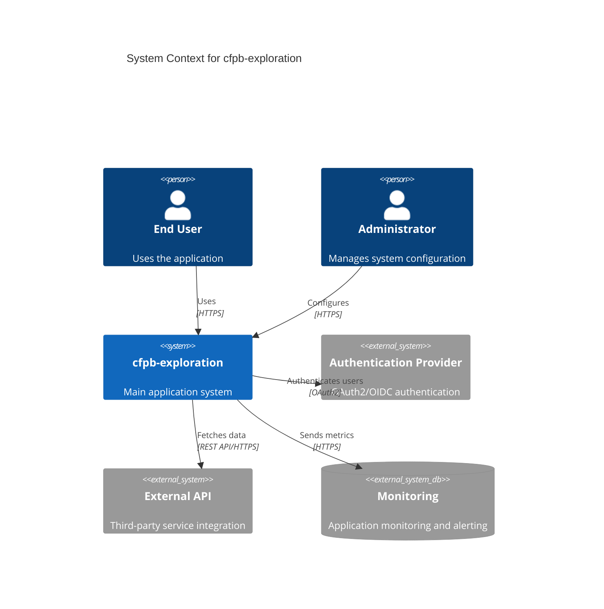

# System Context Diagram

**Purpose**: Show how cfpb-exploration fits in the broader ecosystem

**Last Updated**: {{CURRENT_DATE}}

---

## Diagram

---

## Description

### Actors

**End User**: Primary user of the system who [describe main use cases]

**Administrator**: System administrator who manages configuration, user permissions, and system health

### System

**cfpb-exploration**: [Brief description of what the system does and its key capabilities]

### External Systems

**Authentication Provider**: [e.g., Auth0, Okta, Keycloak] - Handles user authentication via OAuth2/OpenID Connect

**External API**: [Third-party service name] - Provides [functionality, e.g., payment processing, email delivery, data enrichment]

**Monitoring**: [e.g., Datadog, Prometheus, CloudWatch] - Collects application metrics, logs, and alerts

---

## Key Interactions

1. **User Authentication**: Users authenticate through external OAuth2 provider
2. **External Data**: System fetches data from external API for [use case]
3. **Monitoring**: System sends metrics and logs for observability

---

## Related Documentation

- [Container Diagram](./container.md) - Detailed view of system internals
- [Architecture Decision Records](../ADRs/) - Key architectural decisions
- [Deployment Guide](../DEPLOYMENT.md) - How to deploy the system

---

**Note**: This is a template. Replace cfpb-exploration and placeholder text with your project-specific information.
